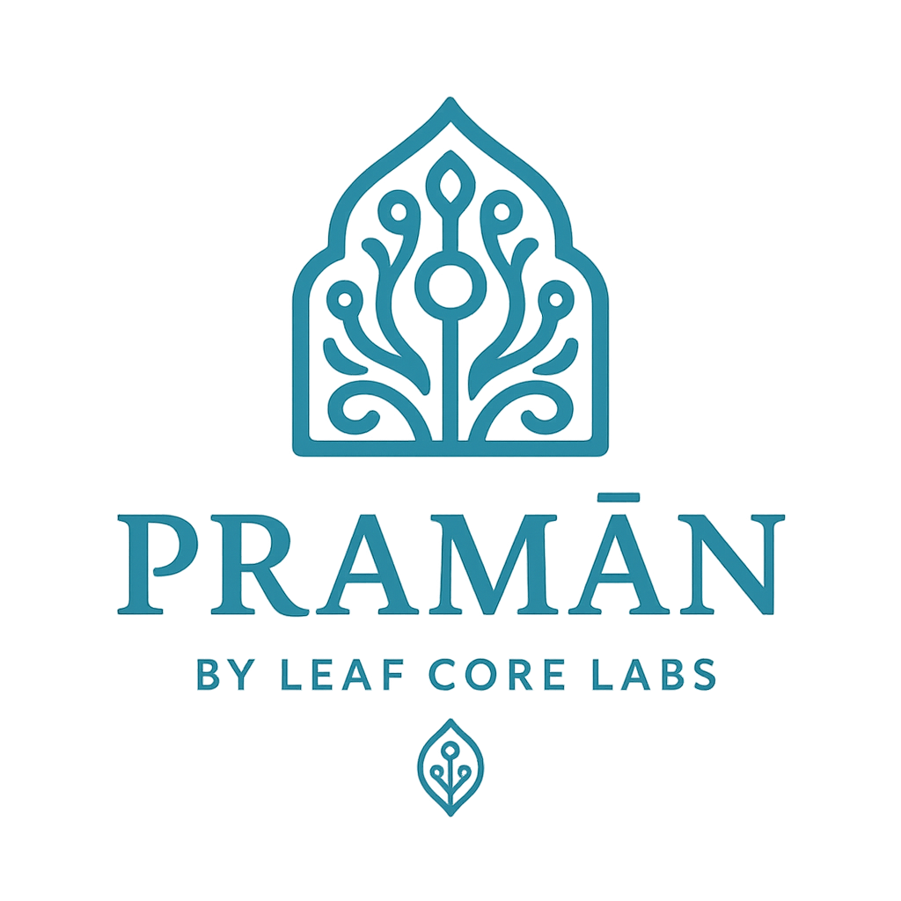

<p align="center">

</p>

<p align="center"><i>"📜 Securing Credentials on the Blockchain"</i></p>

📌 About
Pramān (प्रमाण), meaning "proof" or "evidence" in Sanskrit, is a secure, blockchain-powered certificate issuance and verification platform. Developed by LeafCore Labs, its mission is to combat academic fraud and ensure the authenticity of educational and professional credentials. It provides a robust, digital solution for institutions, organizations, and individuals.

🌟 Features
🔐 Role-Based Access

Admin: Full system monitoring and user management.

Institute/Issuer: Uploads and issues digital certificates.

Organization/Verifier: Verifies certificate authenticity.

🛡️ Immutable Certificate Issuing

Institutions can issue new certificates by uploading a PDF or image.

The system generates a unique QR code and logs an immutable transaction on the blockchain.

🔎 Tamper-Proof Verification

Users can verify a certificate by uploading a file or entering a unique certificate ID.

The system hashes the document and cross-verifies it against the blockchain to flag any tampering.

📝 Smart OCR Extraction

Utilizes EasyOCR to intelligently extract key details (name, roll number, marks, etc.) from uploaded documents, including older, physical certificates.

🔗 Blockchain Integration

Connects to a blockchain network (e.g., Ganache or Polygon testnet) to provide a decentralized, tamper-proof ledger for all records.

✨ User-Friendly Interface

An interactive and user-friendly interface built with Streamlit, featuring a sleek dark and light theme toggle.

📈 Fraud Monitoring

The Admin dashboard provides real-time fraud logs and insights into verification activity.

📐 Architecture
Frontend: Streamlit, Plotly, streamlit-option-menu

Backend: Flask (with Flask-JWT-Extended and Flask-CORS)

Database: SQLite (praman.db) for storing user and certificate metadata.

Blockchain: Web3.py for connecting to a Ganache local testnet or a Polygon public testnet.

OCR: EasyOCR

⚙️ Installation
1️⃣ Clone the repository
```bash
git clone [https://github.com/LeafCoreLabs/praman.git](https://github.com/LeafCoreLabs/praman.git)
cd praman
```
2️⃣ Create a virtual environment & install dependencies
```bash
python -m venv venv
# Activate environment
# Windows:
venv\Scripts\activate
# Linux/Mac:
source venv/bin/activate
pip install -r requirements.txt
```
3️⃣ Run the backend
```bash
python backend.py
```
4️⃣ Run the frontend
```bash 
streamlit run frontend.py
```
🚀 Usage
Open the frontend in your browser (default: http://localhost:8501).

Select your user type: Admin, Institute, or Organization.

Sign Up (for new users) or Login (for existing users).

Admin: Access the dashboard to view fraud logs and manage the system.

Institute: Use the interface to issue new certificates and generate QR codes.

Organization: Verify certificates by uploading a file or entering a certificate ID.

🛠️ API Endpoints
Endpoint

Method

Description

/signup

POST

Register a new user with their role.

/login

POST

Authenticate a user and return a JWT token.

/issue

POST

Issue a new certificate (Institute only).

/verify

POST

Verify a certificate's authenticity.

/ocr

POST

Extract text from a certificate image.

/fraud_logs

GET

Retrieve fraud logs for the Admin dashboard.

/ping

GET

Health check endpoint.

📝 Database Schemas
users: username, password, role, details

certificates: cert_id, issuer, file_hash, status, qr_code, tx_hash, issued_at

fraud_logs: cert_id, tamper_score, logged_at

<p align="center">Made with ❤️ by LeafCore Labs</p>